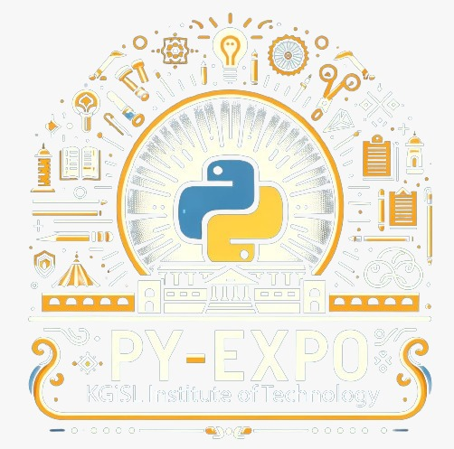
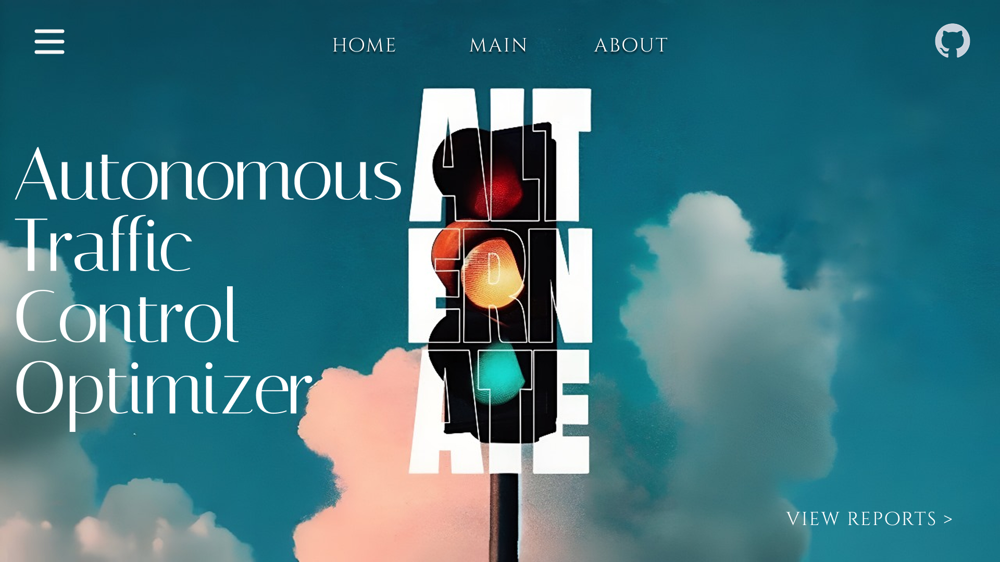
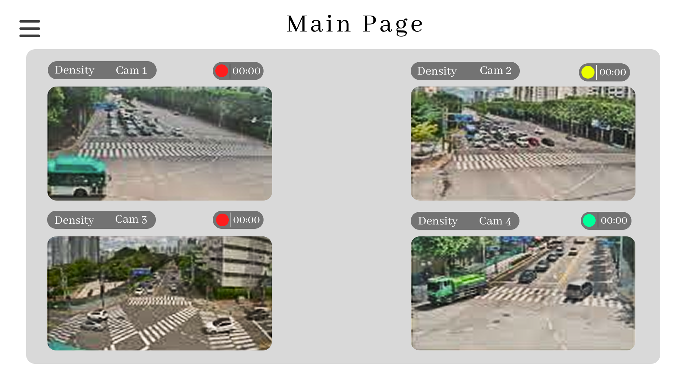
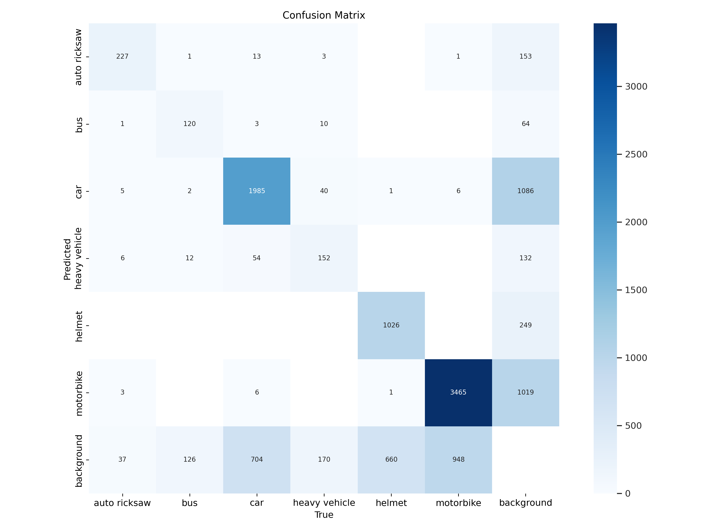

---

## Problem Statement

*Problem Statement ID – xxxxx*

Formulate your problem statement clearly and concisely.

---

## Overview

Provide an overview of the project, its purpose, and what it aims to achieve along with proposed solution

---

## Team Members

*Team ID – xxxxx*

List your team members along with their roles.

- *Member 1* - Team Leader
- *Member 2* - Role
- *Member 3* - Role
- *Member 4* - Role
- *Member 5* - Role
- *Member 6* - Role
- *Member 7* - Role
- *Member 8* - Role

---

## Technical Stack

List the technologies and tools used in the project. For example:

- *Frontend:* HTML, CSS, JavaScript, ReactJS
- *Backend:* Flask, Django
- *Database:* MongoDB, MySQL
- *Other Tools:* Docker, Git, TensorFlow

---

## Getting Started

Follow these steps to clone and run the application locally.

### Prerequisites

1. Install [Python](https://www.python.org/downloads/).
2. Install [Git](https://git-scm.com/).
3. Clone this repository:
   bash
   git clone https://github.com/username/repository-name.git
   

### Installation

1. Navigate to the project directory:
   bash
   cd repository-name
   
2. Create a virtual environment:
   bash
   python -m venv venv
   
3. Activate the virtual environment:
   - On Windows:
     bash
     venv\Scripts\activate
     
   - On macOS/Linux:
     bash
     source venv/bin/activate
     
4. Install dependencies:
   bash
   pip install -r requirements.txt
   
5. Navigate to source
   bash
   cd source
   

---

## Start the Application

1. Run the Flask application:
   bash
   flask run
   
2. Open your browser and navigate to:
   
   http://127.0.0.1:5000/
   

---

## UI Overview

Images to demonstrate the user interface:

*Example pages:*

1. *Landing Page:*
   

2. *Dashboard:*
   

3. *Analytics View:*
   

---

## Resources

### 📄 PowerPoint Presentation
[Click here to view the PPT](insert-drive-link-here)

### 🎥 Project Video
[Click here to view the project demo video](insert-drive-link-here)

### 📹 YouTube Link
[Watch the project on YouTube](insert-youtube-link-here)

---
