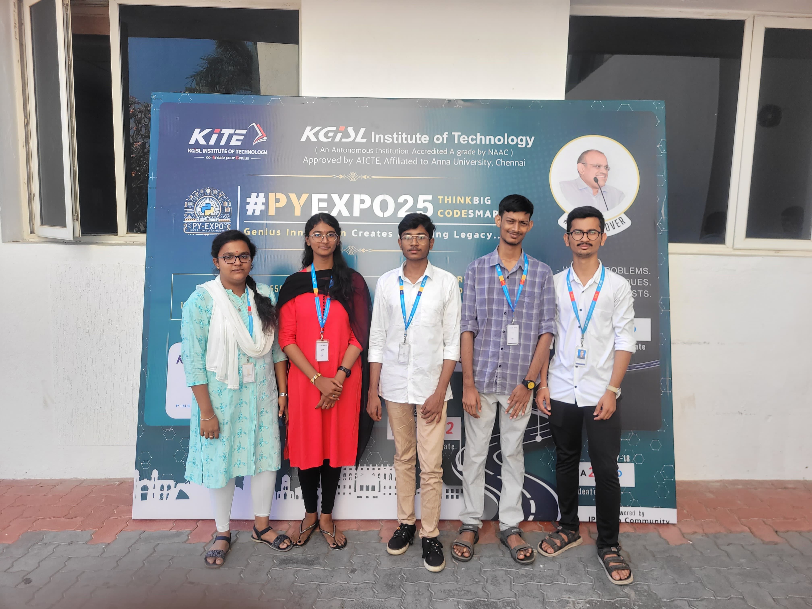

---

## Problem Statement

*Problem Statement ID – PYS114*

Formulate your problem statement clearly and concisely.

---

## Overview

### **Overview**  

This project aims to optimize traffic signal timings using **Deep Learning** to improve traffic flow at junctions. By dynamically adjusting green light durations based on real-time congestion levels, busier lanes receive additional time to clear traffic efficiently. The system continuously updates signal timings for all lanes to maintain smooth movement and reduce delays.  

Additionally, an automated traffic violation detection mechanism is implemented to identify rule violations, such as riding without a helmet. Upon detection, the system notifies traffic authorities, ensuring better enforcement of road safety regulations.

---

## Team Members

*Team ID – T026*

List your team members along with their roles.

- Deepak K M - Over all Cordinator and Execution Evaluator, Backend
- Mirdual R - Backend, Databade
- Jaisurya S - FrontEnd (HTML, CSS)
- Logesh Raj B - FrontEnd (HTML, CSS)
- Piriyadharshini L K - FrontEnd (Java Script - Animation)

---

## Technical Stack

List the technologies and tools used in the project. For example:

- *Frontend:* HTML, CSS, JavaScript
- *Backend:* Flask, Django (gotta psick one)
- *Database:* MySQL
- *Other Tools:* Git, TensorFlow

---

## Getting Started

Follow these steps to clone and run the application locally.

### Prerequisites

1. Install [Python](https://www.python.org/downloads/).
2. Install [Git](https://git-scm.com/).
3. Clone this repository:
   bash
   git clone https://github.com/username/repository-name.git
   

### Installation

1. Navigate to the project directory:
   bash
   cd repository-name
   
2. Create a virtual environment:
   bash
   python -m venv venv
   
3. Activate the virtual environment:
   - On Windows:
     bash
     venv\Scripts\activate
     
   - On macOS/Linux:
     bash
     source venv/bin/activate
     
4. Install dependencies:
   bash
   pip install -r requirements.txt
   
5. Navigate to source
   bash
   cd source
   

---

## Start the Application

1. Run the Flask application:
   bash
   flask run
   
2. Open your browser and navigate to:
   
   http://127.0.0.1:5000/
   

---

## UI Overview

Images to demonstrate the user interface:

*Example pages:*

1. *Landing Page:*
   

2. *Dashboard:*
   

3. *Analytics View:*
   

---

## Resources

### 📄 PowerPoint Presentation
[Click here to view the PPT](insert-drive-link-here)

### 🎥 Project Video
[Click here to view the project demo video](insert-drive-link-here)

### 📹 YouTube Link
[Watch the project on YouTube](insert-youtube-link-here)

---
